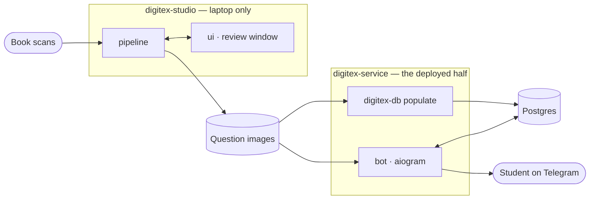

# Project Context

<!-- A map, not documentation. Whole file stays under 100 lines.
     Exclusion test: if a reader could learn it by opening the code or
     running `ls`, it does not belong here.
     When a section hits its cap, replace its weakest entry — never extend. -->

## Overview

Digitex turns scanned exam books into a corpus of question images and serves
them to students as a Telegram test bot with automatic grading. It is built for
the Belarusian centralized exams (ЦТ and ЦЭ) — students practise on it, and one
operator maintains the corpus from a laptop. It replaces the printed book with
the answer key at the back, worked through by hand and scored by hand.

<!-- Cap: 3 sentences — what it does, who it is for, what it replaces. -->

______________________________________________________________________

## Architecture

<!-- Cap: one diagram, 10 nodes max. Name components and data flow only.
     No per-file breakdown, no prose restating the diagram. -->

______________________________________________________________________

## Vocabulary

<!-- Cap: 7 terms. Only terms whose meaning here differs from the plain-English
     or library one. If the identifier already says it, leave it out. -->

Every other domain term is defined in [docs/glossary.md](docs/glossary.md).

- **Option** — a numbered variant of one exam (1–10), not a CLI flag; a Book
  interleaves several across its Pages
- **Part** — `"A"` (numbered answers) or `"B"` (free text); every Question has one
- **Placement** — the Option/Part/number a Question is *written as*, not a coordinate
- **Numbering fault** — a Placement that would not continue its output folder:
  a collision with an extracted file, or a hole past the end
- **OpenUow** — the transaction seam (`domain.ports`): a factory that starts a
  transaction, never an already-open one
- **Round** — the per-update handle on one question round (`bot.answer_flow`),
  owning the bot, the FSM state and the transaction seam
- **Workspace member** — one of the three distributions the repo builds, not an
  editor workspace

______________________________________________________________________

## Decisions

<!-- Cap: 5 entries. Format: X over Y because Z.
     Only decisions a contributor would otherwise reverse by accident. -->

- **Ports in `domain` over a `bot` → `db` import** — because the transaction
  seam then has exactly one owner (`service/cli/bot.py`) and handlers are
  testable against fakes
- **Three distributions over one package** — because the production image never
  resolves OpenCV, torch or Tesseract; the deploy boundary is a packaging fact
  rather than a rule
- **Refusing a Placement over a renumbering pass** — because `numbering_fault`
  gates the review window and the write alike, so the output tree is never out
  of order to begin with
- **Immutable `session_answers` over scoring off the live corpus** — because
  each row keeps the `correct_answer` it was judged against, so re-loading the
  corpus cannot rewrite a finished test
- **`settings.paths.data_root` over `__file__`-relative paths** — because an
  installed wheel ships no source tree and must still find the corpus

______________________________________________________________________

## Non-Goals

<!-- Cap: 5 entries. Only things a reasonable contributor might add anyway. -->

- An ORM — repositories write SQL by hand, one class per role
- Autogenerated migrations — Alembic scripts are hand-written raw SQL
- A web or REST surface — Telegram is the only student-facing entry point
- ML at serve time — the bot serves pre-extracted images and cached `file_id`s
- A repair pass over extraction output — faults are refused, never fixed up
